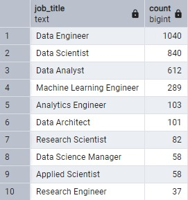
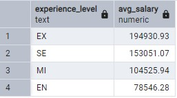
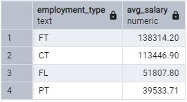
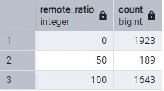
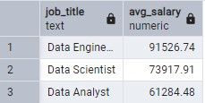

# eda_with_postgresql

---

## Table of Contents
1. [Introduction](#1-introduction)
2. [Objectives](#2-objectives)
3. [Data Sources](#3-data-sources)
4. [Setup & Environment](#4-setup--environment)
5. [Database Schema](#5-database-schema)
6. [Data Ingestion](#6-data-ingestion)
7. [Data Cleaning](#7-data-cleaning)
8. [Exploratory Data Analysis (EDA)](#8-exploratory-data-analysis-eda)
   - [8.1 Job Title Distribution](#81-job-title-distribution)
   - [8.2 Experience Level vs. Average Salary](#82-experience-level-vs-average-salary)
   - [8.3 Employment Type vs. Average Salary](#83-employment-type-vs-average-salary)
   - [8.4 Remote Work Distribution](#84-remote-work-distribution)
   - [8.5 HR-Specific Analysis (FT & EN)](#85-hr-specific-analysis-ft--en)
9. [Conclusion & Recommendations](#9-conclusion--recommendations)
10. [Appendix](#10-appendix)

---

## 1. Introduction
This project aims to explore and analyze data science salary information by performing data cleaning and exploratory data analysis (EDA) using PostgreSQL. The insights will support the HR team in negotiating salaries for Full-time Data Analyst, Data Scientist, and Data Engineer candidates.

---

## 2. Objectives
- Ensure data quality through cleaning and validation.
- Calculate the average salary in USD for Full-time Data Analyst, Data Scientist, and Data Engineer roles at experience level EN.
- Present findings in tables and visualizations to support HR decision-making.

---

## 3. Data Sources
- Kaggle dataset: [ds-salary](https://www.kaggle.com/datasets/hoangphihung44/ds-salary)

---

## 4. Setup & Environment
1. Install PostgreSQL v17 and pgAdmin 4.
2. Create a new database (e.g., `ds_salaries_db`).
3. (Optional) Install Python libraries for scripting:
   ```bash
   pip install psycopg2 pandas
   ```
4. Configure a `.env` file for database credentials.

---

## 5. Database Schema
Table: `ds_salaries_data`

| Column              | Data Type | Description                         |
| ------------------- | --------- | ----------------------------------- |
| work_year           | INTEGER   | Year the employee worked            |
| experience_level    | TEXT      | Experience level (EN, MI, SE, EX)   |
| employment_type     | TEXT      | Employment type (FT, CT, FL, PT)    |
| job_title           | TEXT      | Job title                           |
| salary              | INTEGER   | Salary in original currency         |
| salary_currency     | TEXT      | Currency of the salary              |
| salary_in_usd       | INTEGER   | Salary converted to USD             |
| employee_residence  | TEXT      | Country of residence                |
| remote_ratio        | INTEGER   | Remote work percentage (0, 50, 100) |
| company_location    | TEXT      | Company location                    |
| company_size        | TEXT      | Company size (S, M, L)              |

---

## 6. Data Ingestion
```sql
CREATE TABLE IF NOT EXISTS public.ds_salaries_data (
  work_year INTEGER,
  experience_level TEXT,
  employment_type TEXT,
  job_title TEXT,
  salary INTEGER,
  salary_currency TEXT,
  salary_in_usd INTEGER,
  employee_residence TEXT,
  remote_ratio INTEGER,
  company_location TEXT,
  company_size TEXT
);

\copy ds_salaries_data FROM 'path/to/ds_salaries.csv' WITH CSV HEADER;
```

---

## 7. Data Cleaning
- **Missing Values:**
  ```sql
  SELECT COUNT(*) AS missing_count
  FROM ds_salaries_data
  WHERE work_year IS NULL
    OR experience_level IS NULL
    OR employment_type IS NULL
    OR job_title IS NULL
    OR salary IS NULL
    OR salary_currency IS NULL
    OR salary_in_usd IS NULL
    OR employee_residence IS NULL
    OR remote_ratio IS NULL
    OR company_location IS NULL
    OR company_size IS NULL;
  ```
- **Duplicates:**
  ```sql
  SELECT job_title, salary_in_usd, COUNT(*)
  FROM ds_salaries_data
  GROUP BY job_title, salary_in_usd
  HAVING COUNT(*) > 1;
  ```
- **Casting & Standardization:**
  - Convert `remote_ratio` to INTEGER.
  - Validate currency codes in `salary_currency`.

---

## 8. Exploratory Data Analysis (EDA)

### 8.1 Job Title Distribution
```sql
SELECT job_title, COUNT(*) AS count
FROM ds_salaries_data
GROUP BY job_title
ORDER BY count DESC
LIMIT 10;
```
> 

### 8.2 Experience Level vs. Average Salary
```sql
SELECT experience_level,
       ROUND(AVG(salary_in_usd), 2) AS avg_salary
FROM ds_salaries_data
GROUP BY experience_level
ORDER BY avg_salary DESC;
```
> 

### 8.3 Employment Type vs. Average Salary
```sql
SELECT employment_type,
       ROUND(AVG(salary_in_usd), 2) AS avg_salary
FROM ds_salaries_data
GROUP BY employment_type
ORDER BY avg_salary DESC;
```
> 

### 8.4 Remote Work Distribution
```sql
SELECT remote_ratio, COUNT(*) AS count
FROM ds_salaries_data
GROUP BY remote_ratio
ORDER BY remote_ratio;
```
> 

### 8.5 HR-Specific Analysis (FT & EN)
```sql
SELECT job_title,
       ROUND(AVG(salary_in_usd), 2) AS avg_salary
FROM ds_salaries_data
WHERE job_title IN ('Data Engineer', 'Data Scientist', 'Data Analyst')
  AND experience_level = 'EN'
  AND employment_type = 'FT'
GROUP BY job_title
ORDER BY avg_salary DESC;
```
> 


---

## 9. Conclusion & Recommendations
- **Data Engineer** has the highest average salary (91,525.74 USD).
- **Data Scientist** follows (73,917.91 USD).
- **Data Analyst** ranks third (61,284.48 USD).

---

**Recommendations:**
1. HR can adjust salary offers based on these benchmarks.
2. Monitor annual salary trends for ongoing updates.
3. Explore additional factors such as company size or location for deeper insights.

---

## 10. Appendix
- Full SQL scripts: `sql/01_ingestion.sql`, `sql/02_cleaning.sql`, `sql/03_eda.sql`


